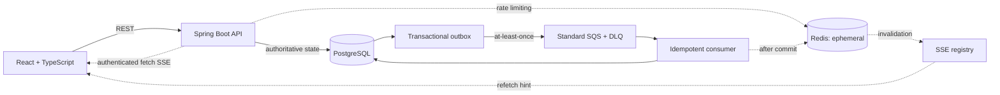

# CrowdPass

CrowdPass is a polished event reservation product built around a deliberately simple rule:
PostgreSQL—not Redis, a message broker, or an in-memory counter—is authoritative for every seat.
Its React experience makes atomic capacity acquisition, a transactional FIFO waitlist, HTTP
idempotency, durable notifications and realtime invalidation tangible to a user.

## What makes it interesting

- **No overselling:** conditional PostgreSQL updates and database constraints protect capacity.
- **Fair cancellation:** every seat-changing transaction locks the event row first; cancellation
  promotes the oldest waiter synchronously before a new direct reservation can bypass the queue.
- **Two explicit idempotency boundaries:** HTTP retries replay a stored response, while duplicate SQS
  deliveries are absorbed by a separate PostgreSQL `source_event_id` constraint.
- **Durable async work:** the domain change and outbox event commit together; Standard SQS transport
  is at-least-once and never described as exactly-once.
- **Safe degradation:** Redis rate limiting fails open and Redis Pub/Sub is ephemeral, while durable
  correctness and notification recovery remain PostgreSQL-backed.

## Architecture



PostgreSQL owns all durable business state. Redis owns no durable business state. See
[engineering design](docs/engineering-design.md) for lock ordering and transaction boundaries.

## Correctness and reliability

Core invariants include `confirmed reservations <= event capacity`, at most one active reservation
or waiting entry per user/event, no waitlist bypass, committed FIFO sequence order, and synchronous
promotion in the cancellation transaction. Concurrency tests use real PostgreSQL through
Testcontainers; constraints and concurrency checks are not replaced by mocks.

The transactional outbox tolerates SQS outages without rolling back successful domain operations.
Consumer idempotency tolerates redelivery. SSE carries only invalidation; clients refetch durable
notifications after reconnect. See [failure modes](docs/failure-modes.md).

## Observability

CrowdPass provides request IDs in responses, structured `ApiError`, correlated logs, separate
`/livez` and PostgreSQL-aware `/readyz`, JVM/Hikari/HTTP metrics, and focused bounded-cardinality
metrics for reservations, waitlists, idempotency, outbox backlog, notifications, rate-limit
fail-open and realtime delivery.

The default application exposes only Actuator health/info. An explicit `observability` profile adds
ADMIN-protected metrics and Prometheus format. The [observability guide](docs/observability.md)
contains the catalog, investigation workflow, local demo and proposed—not achieved—SLO targets.

## Measured local evidence

These are local Apple M3/Docker measurements with k6 sharing the physical host. They are not AWS or
production capacity claims.

- 1,000 users competed for 100 seats: exactly 100 confirmed, 900 `EVENT_FULL`, zero oversell.
- Three independent 1,000-request/200-VU same-key storms each produced one logical reservation.
- A 30-second local 500 reservation/s plateau completed 15,001 confirmations with p95 3.09 ms and
  p99 27.41 ms while preserving every database invariant.
- A 30-second local public-read plateau achieved 4,998.52 req/s with p95 1.68 ms and p99 6.17 ms;
  CPU was the first pressure signal. Hikari pending remained zero, so the pool stayed 10.

See [Phase 13 results](performance/results/README.md) and the [performance harness](performance/README.md).

## AWS and delivery proof

CrowdPass was temporarily deployed and smoke-tested on AWS, then destroyed. The exercised design
used an ARM64 non-root image, private encrypted PostgreSQL RDS, ECS/Fargate, immutable ECR images,
Standard SQS plus DLQ, SSM Parameter Store, CloudWatch Logs and an ephemeral Redis sidecar—with no
NAT Gateway, ALB, public application ingress or task inbound rules.

GitHub Actions runs JVM/Testcontainers tests, offline deployment/privacy validation, a native ARM64
image check and Terraform validation. Gated manual CD uses GitHub OIDC, not static AWS credentials.
Terraform apply/no-op-plan/destroy and survivor audits were exercised. See [`deploy/aws`](deploy/aws/README.md),
[`infra/terraform`](infra/terraform/README.md), and the [CD contract](deploy/aws/cd-contract.md).

## Product experience

The responsive browser application supports event discovery, registration/login, reservation and
cancellation, full-event waitlists, promotion state, account history, durable notifications and
authenticated fetch-based SSE. TanStack Query refetches authoritative server state after mutations
and realtime signals. The access token is session-scoped and never enters URLs or logs. See the
[frontend guide](frontend/README.md) for local setup and the truthful demo-data flow.

## Technology

React 19, TypeScript, Vite, React Router, TanStack Query, Java 21, Spring Boot 4, Spring Security/JWT,
Spring Data JPA, PostgreSQL 17, Flyway, Redis, AWS SDK, Standard SQS, SSE, Micrometer/Prometheus,
Testcontainers, Vitest, k6, Docker, Terraform and GitHub Actions.

## Run locally

Prerequisites are JDK 21 and Docker. Maven itself is not required.

```sh
docker compose up -d postgres redis elasticmq
SPRING_PROFILES_ACTIVE=local ./mvnw spring-boot:run
curl http://localhost:8080/livez
curl http://localhost:8080/readyz
```

Then run the browser application:

```sh
cd frontend
npm ci
npm run dev
```

Vite proxies `/api` to the local backend, so no development CORS exception is required.

The `local` profile supplies disposable developer defaults. Production-style configuration requires
database settings plus separate JWT and rate-limit HMAC secrets. The hardened container runs as
UID/GID `10001:10001`, with a read-only root filesystem and dropped Linux capabilities:

```sh
docker compose --profile app up --build
```

## Test and benchmark

```sh
./mvnw test
cd frontend && npm run validate
performance/scripts/validate.sh
```

Performance runs must use the documented disposable harness and never target non-benchmark data.

## Security and privacy

The API is stateless and deny-by-default. Passwords use bcrypt; raw passwords, JWTs, authorization
headers, idempotency keys, emails and IP addresses are not logged or used as metric labels.
Rate-limit identities are HMAC-derived, PostgreSQL DETAIL is disabled to avoid row-value leakage,
runtime secrets come from environment/SSM, and CI scans for credentials, state and generated data.

## Intentional limitations

- Modular monolith, not independently deployed microservices.
- No payment processing, organizer event-creation UI or permanent public deployment.
- Fixed-window Redis abuse limits and ephemeral realtime invalidation by design.
- Local load generator and server share one host; results cannot be extrapolated to production.
- AWS verification was temporary and the potentially billable infrastructure was destroyed.
- Proposed SLOs have not been validated by sustained production traffic.

Flyway owns schema changes; Hibernate uses `ddl-auto=validate`. Five migrations currently define the
schema through PostgreSQL-backed HTTP idempotency.
