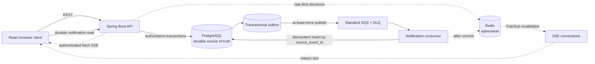

# Engineering design notes

## Architecture

PostgreSQL alone decides seats, waitlist membership, HTTP idempotency and durable notifications.
Redis limits abuse and fans out ephemeral invalidations. SQS transports outbox events at least once.

## Correctness choices

- `events.reserved_count` is changed only by conditional SQL, never a stale entity snapshot.
- Every seat/waitlist mutation locks the event row first. This provides one lock order, prevents
  waitlist bypass, and makes committed FIFO `queue_seq` the promotion order.
- Cancellation promotes the oldest waiter synchronously in the same transaction; only when no
  waiter exists is capacity released.
- `confirmed reservations <= event capacity` is enforced jointly by atomic SQL and constraints.
- Same user + same idempotency key + same request yields one logical mutation and a replayable
  response. This is separate from SQS consumer idempotency.
- Standard SQS is deliberately at-least-once. PostgreSQL `source_event_id` uniqueness absorbs
  duplicate notification delivery; CrowdPass does not claim global exactly-once messaging.

## Why these boundaries

Redis was rejected for seat correctness because fail-open abuse protection and ephemeral Pub/Sub are
valuable only if losing Redis cannot corrupt durable state. The transactional outbox closes the
database/message dual-write gap without pretending SQS and PostgreSQL share a transaction. Realtime
uses a durable notification plus a small invalidation signal so reconnect/recovery never requires an
SSE replay log.

Phase 13 found zero steady-state Hikari pending acquisitions at retained plateaus, so the maximum
pool remained 10. Increasing it would add database concurrency without addressing the first observed
local pressure signal: application/request-processing CPU at 5,000 local read requests/s.

## Scaling beyond the demonstrated envelope

Before splitting services, measure on separated load-generator/server hosts with production-shaped
datasets. Likely next steps are database/read-path profiling, horizontally scaled stateless API
instances, managed Redis for abuse protection/fan-out, independently scaled publisher/consumer
workers, DLQ alarms, and multi-AZ PostgreSQL. Partitioning events or queues is justified only by
measured contention/throughput, and must preserve per-event correctness. Payments, an organizer
event-creation UI and a permanently operated public deployment remain intentionally out of scope.
